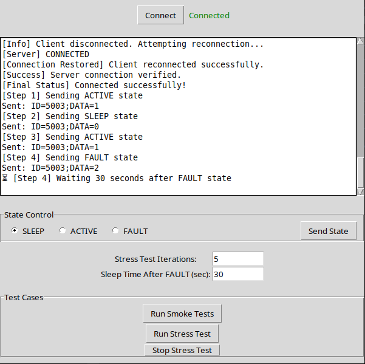

# Simulation Project

## Visual Reference
Include an image here to showcase the application interface:



Make sure the `interface.png` image is placed in the `assets` folder.

---

## How to Setup the Simulation

1. **Install Python 3:** Ensure that Python 3 is installed on your system. You can download it from [Python's official website](https://www.python.org/).
2. **Run Setup Command
   ```bash
   pip install -r pipinstall.txt --break-system-packages
   ```
   This command will install all necessary dependencies and prepare the environment for the simulation.

---

## How to Run the Project

To start the simulation, run the following comand:
```bash
python3 main.py
```

This will launch the simulation environment.

---

## How to Test

Before performing any test, **press the 'Connect' button** in the application to establish a proper connection.

### Manual Testing
- The interface contains **three radio buttons** representing different states:
  - **SLEEP**
  - **ACTIVE**
  - **FAULT**
- Select one of the states and press the **'Send State'** button to apply the selected state.

### Automation Testing
Automation testing supports two types of tests:

#### **Smoke Test**
- This test cycles through the states automatically in the following sequence:
  - SLEEP → ACTIVE → FAULT
- To execute, press the **'Run Smoke Test'** button.

#### **Stress Test**
- This test cycles through the states automatically in the following sequence:
  - ACTIVE → SLEEP → ACTIVE → FAULT
- Two configurable parameters:
  - **Stress Test Iteration:** Number of test repetitions.
  - **Sleep Time after FAULT:** Delay before starting the next iteration.
- To execute, press the **'Run Stress Test'** button.

After performing automation tests, ensure to **refresh the connection**.

---

## Update After Tests
After completing any automation test, it is necessary to **refresh the connection** in the application to ensure consistent performance.

---

Enjoy your simulation testing!
